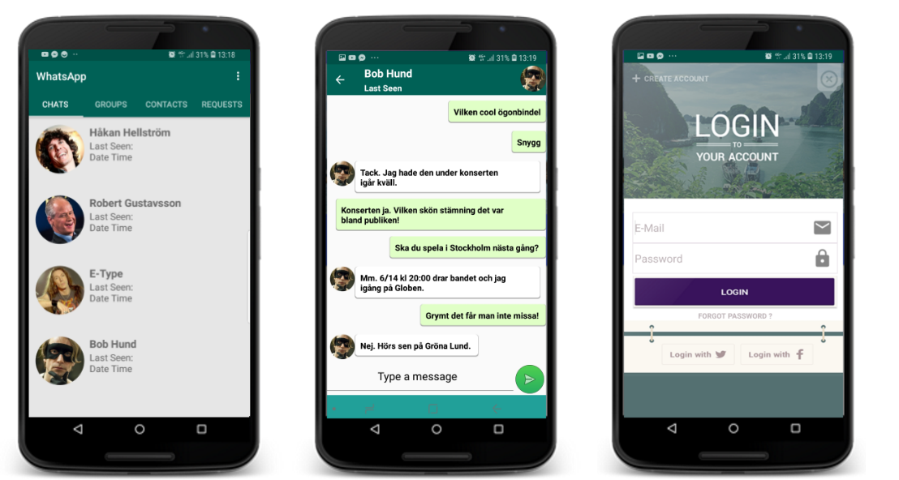

# Android WhatsApp 

This repository contains the source code for the GitHub Android app.

Please see the [issues](https://github.com/forkhubs/android/issues) section to
report any bugs or feature requests and to see the list of known issues.

## License

* [Apache Version 2.0](http://www.apache.org/licenses/LICENSE-2.0.html)

## Building

### With Gradle

The easiest way to build is to install [Android Studio](https://developer.android.com/sdk/index.html) v1.+.
Once installed, then you can import the project into Android Studio:

1. Open `File`
2. Import Project
3. Select `build.gradle` under the project directory
4. Click `OK`

Then, Gradle will do everything for you.

You might find that your device doesn't let you install your build if you
already have the version from Google Play installed.  This is standard
Android security as it it won't let you directly replace an app that's been
signed with a different key.  Manually uninstall GitHub from your device and
you will then be able to install your own built version.

## Acknowledgements

This project uses the [GitHub Java API](https://github.com/eclipse/egit-github/tree/master/org.eclipse.egit.github.core)
built on top of [API v3](http://developer.github.com/).

It also uses many other open source libraries such as:

* [CodeMirror](https://github.com/codemirror/CodeMirror)
* [RoboGuice](https://github.com/roboguice/roboguice)
* [ViewPagerIndicator](https://github.com/JakeWharton/Android-ViewPagerIndicator)

These are just a few of the major dependencies, the entire list of dependencies
is listed in the [app's build.gradle file](https://github.com/forkhubs/android/blob/master/app/build.gradle).

## Contributing

Please fork this repository and contribute back using
[pull requests](https://github.com/forkhubs/android/pulls).

Any contributions, large or small, major features, bug fixes, additional
language translations, unit/integration tests are welcomed and appreciated
but will be thoroughly reviewed and discussed.
